# Teachable Machine Client App 💻

A simple client app with local server hosting for AI made with <a href="https://teachablemachine.withgoogle.com/" style="color:lightblue">Teachable Machine</a>. Using this repo you can start a local server in your desktop and access across devices in your same network.

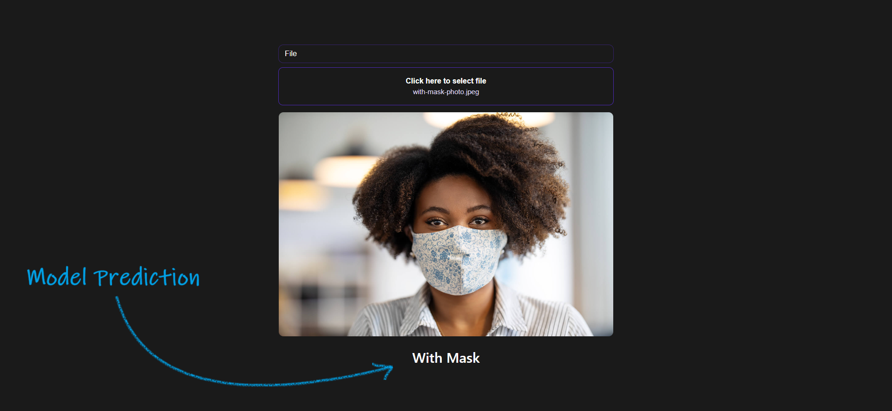

- Features
  - Image upload
  - Camera (both front and rear)
  - Camera controls (play and pause)
  - Custom Theme
  - Ngrok Supported

Follow the steps below to setup a frontend for your AI model trained with Teachable machine.

---

<details>
<summary>How to build a AI model with <a href="https://teachablemachine.withgoogle.com/" style="color:lightblue">Teachable Machine</a></summary>
<br/>

#### Step 1

Go to <a href="https://teachablemachine.withgoogle.com/train/image">https://teachablemachine.withgoogle.com/train/image</a>

#### Step 2

Name the different classes for your model

#### Step 3

Upload Different Image from different angles for each class or click on webcam to open webcam and take photo realtime

#### Step 4

Click on Train Model
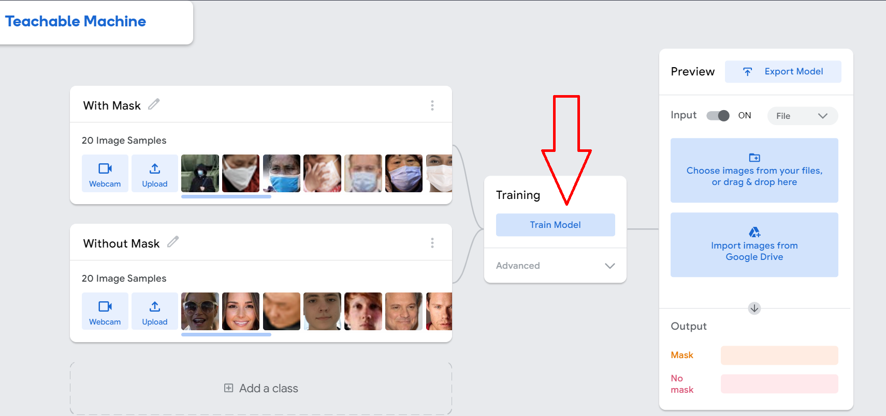

#### Step 5

Click on Export Model
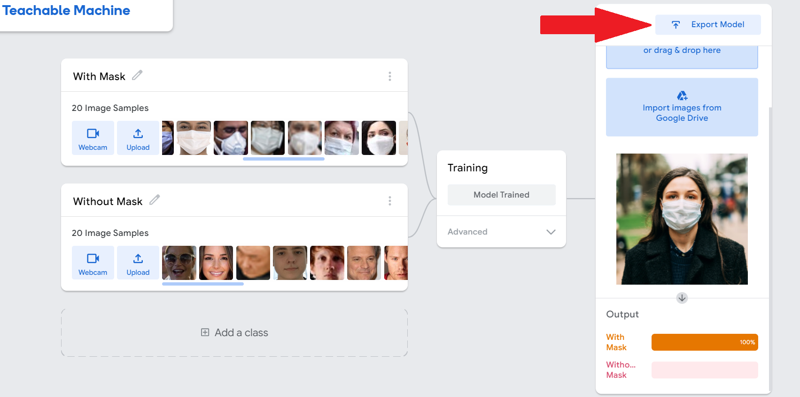
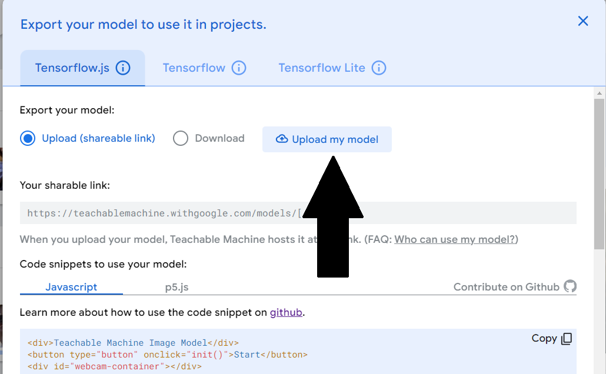

Upload or Download your Model

</details>

---

## Step 1

<details open>
<summary>
Manually Download the zip
</summary>

- Download the zip and Extract the files
  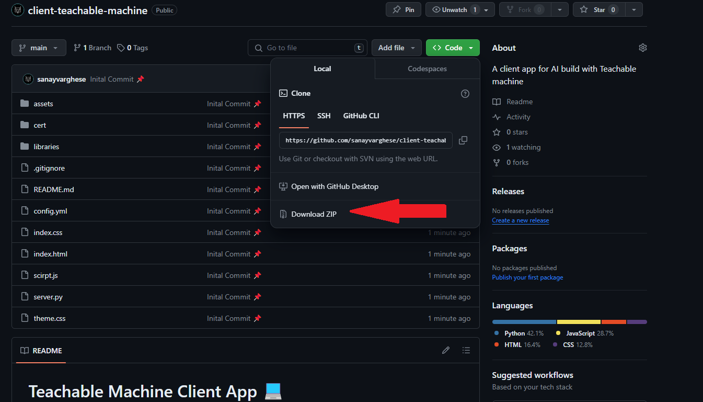
- Open the folder and click on the address bar and type cmd.exe
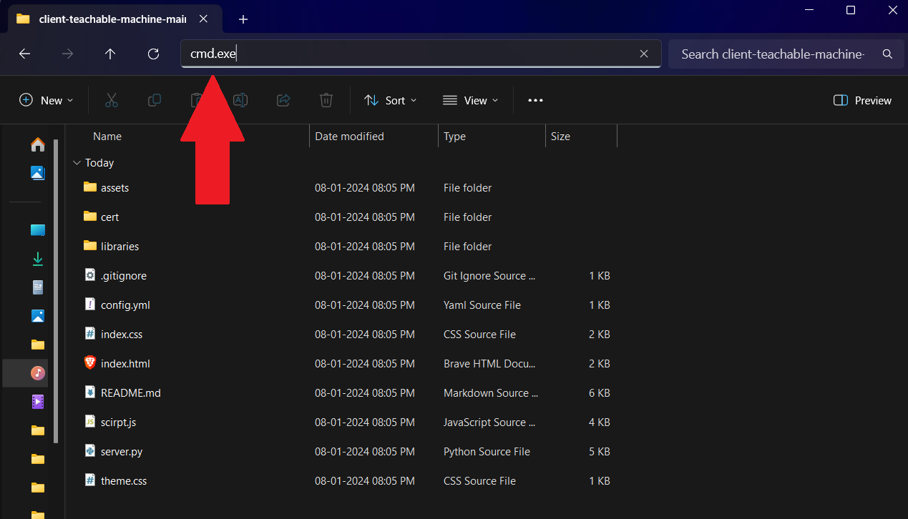
This will open cmd on the project folder
</details>

<details>
<summary>
Using Git
</summary>

- Open cmd.exe (from start menu or Press <kbd>Win + R</kbd> and type cmd.exe and Press Ok)

  Clone the repository and navigate to the folder

  ```
  git clone https://github.com/sanayvarghese/client-teachable-machine.git
  ```

  ```
  cd client-teachable-machine
  ```

</details>

## Step 2

Now open the browser and get your Teachable machine trained AI model link or download the model and edit the [`config.yml`](./config.yml) file

<details open>
  <summary>Using Teachable machine model link</summary>
  <br/>

- #### First upload your model

  
  <br/>

- #### Copy the sharable link

  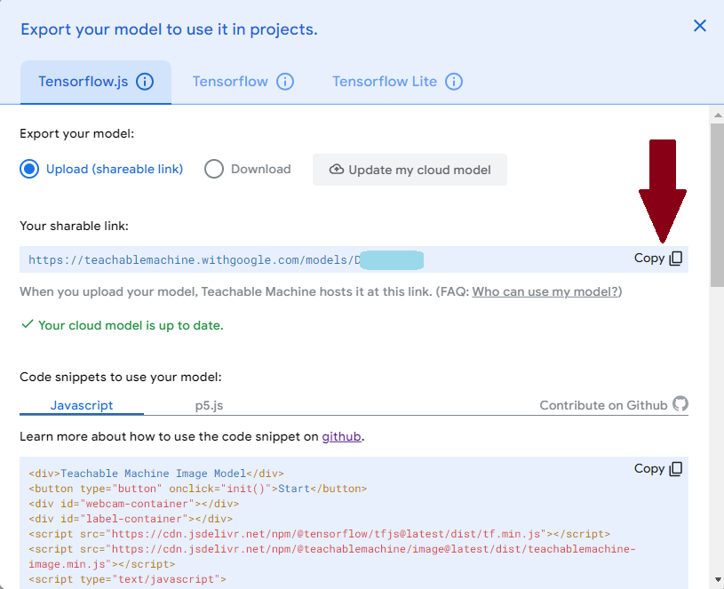
  <br/>

- #### Paste the link in config.yml file for the field `TEACHABLE_MACHINE_URL`
  Eg: [`config.yml`](./config.yml)

```yaml
TEACHABLE_MACHINE_URL: https://teachablemachine.withgoogle.com/models/XXXXXX/
```

Replace `https://teachablemachine.withgoogle.com/models/XXXXXX/` with your link
<br/>

</details>

<details>

<summary>Using downloaded model</summary>

- #### First download the model

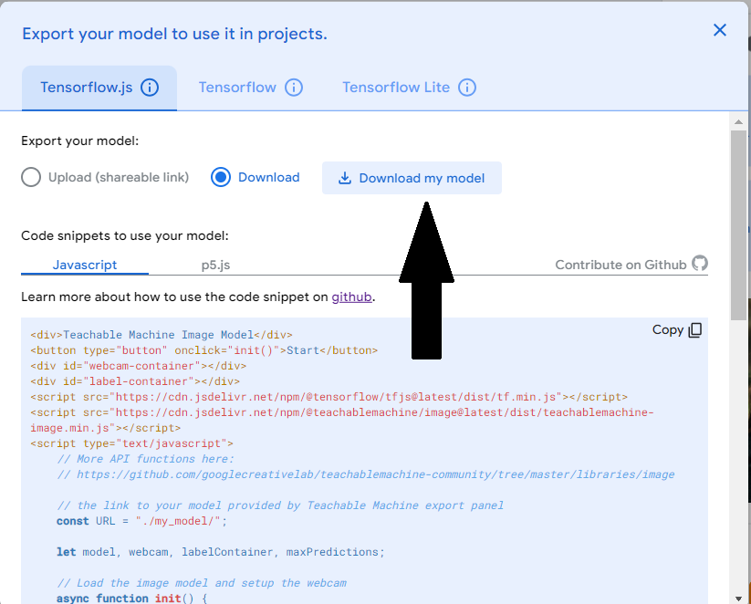

**And move to the project folder**
<br/>

- #### Unzip and move the files to `libraries/` folder
  Files are
  - `metadata.json`
  - `model.json`
  - `weights.bin`
    <br/>
- #### Edit the config.yml file's `TEACHABLE_MACHINE_URL` field

  Now [`config.yml`](./config.yml) will be like

  ```yaml
  TEACHABLE_MACHINE_URL: ./libraries/
  ```

</details>

## Step 3

> [!TIP]
> If you want to start a secure server and access your server from any device consider using Ngrok
> We have provided the steps to setup [ngrok](#ngrok-setup) with our project in [FAQ](#faq)

Start server and host the app on the local machine

In cmd.exe type:

```
python server.py
```

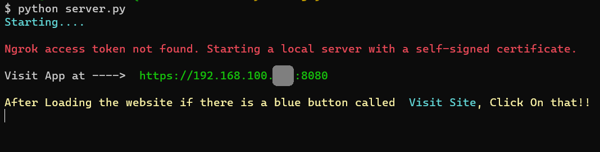

Our app will be now hosted on `https://<your ip>:8000`
Now visit this url using a browser on same device or another device on same network.

Now this warning page will appear.
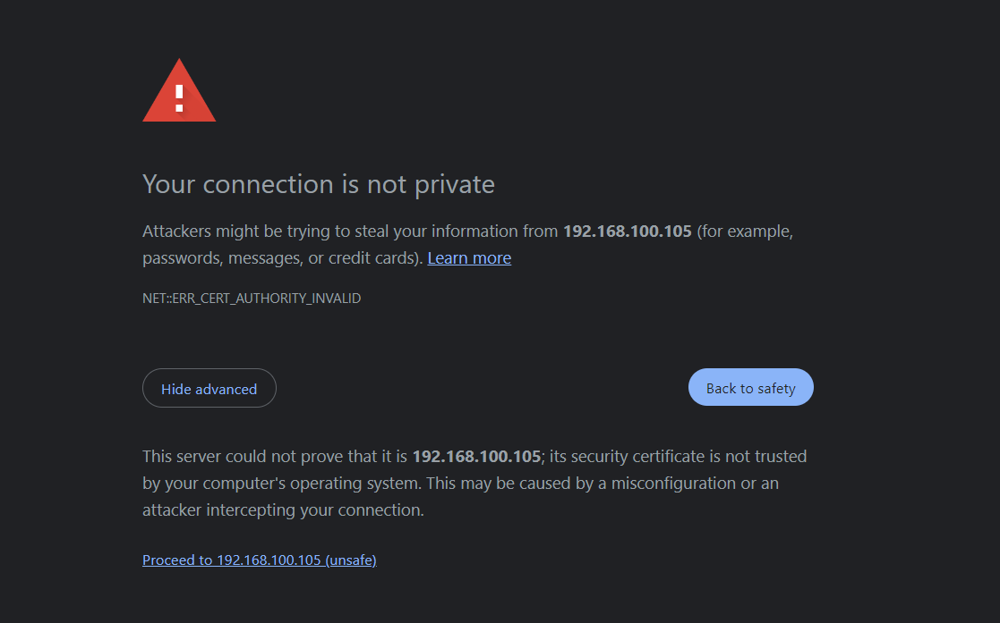

Click on `Advanced` and click on `Proceed to ...`
Accept the camera permission to enable camera.

Now our app is perfectly working! 🥳🎉
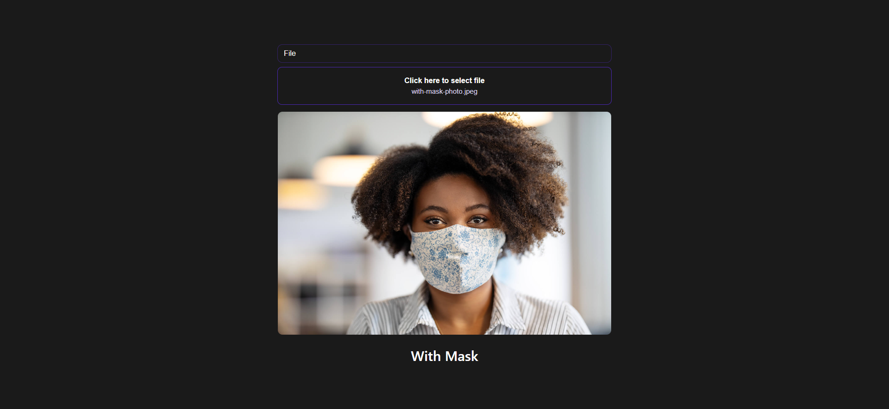

> [!TIP]
> You can set custom theme colors by changing [theme.css](./theme.css) (We have also provided a detailed walkthrough in [FAQ](#custom-themes-setup))

> [!TIP]
> You can change the facing mode of camera in [config.yml](./config.yml) (We have also provided a detailed walkthrough in [FAQ](#camera-view-change))

# FAQ

<details id="camera-view-change">
<summary >
Q1. How to change the camera view?
</summary>

<h5>Step 1</h5>

Open the [`config.yml`](./config.yml) file and edit `CAMERA_FACING` to your desired mode

```yml
CAMERA_FACING: "front"
```

<p style="width:100%;text-align:center">OR</p>

```yml
CAMERA_FACING: "rear"
```

And Restart your server

</details>

<details id="ngrok-setup">
<summary>
Q2. How to integrate Ngrok with our app?
</summary>

<h5>Step 1</h5>

Go to <a href="https://dashboard.ngrok.com/" style="color:lightblue">ngrok dashboard</a> and copy your auth_token (Eg: 2HaR4n5oF4XXXXXXXXXXX)

<h5>Step 2</h5>

Edit the [`config.yml`](./config.yml)

```yml
NGROK_AUTH_TOKEN: <your ngrok_auth_token>
```

Replace `<your ngrok_auth_token>` with your copied token

<h5>Step 3</h5>
Start the server
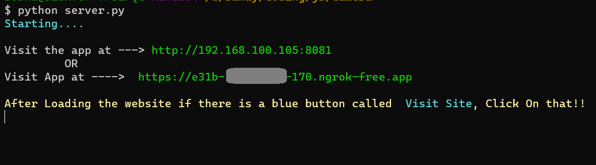

<h5>Step 4</h5>

- For devices on the same network,

  - Visit `http://<your ip>:8001` which will redirect to ngrok hosted website
  - If your Visiting the site for first time a prompt will appear, click on Visit Site button
    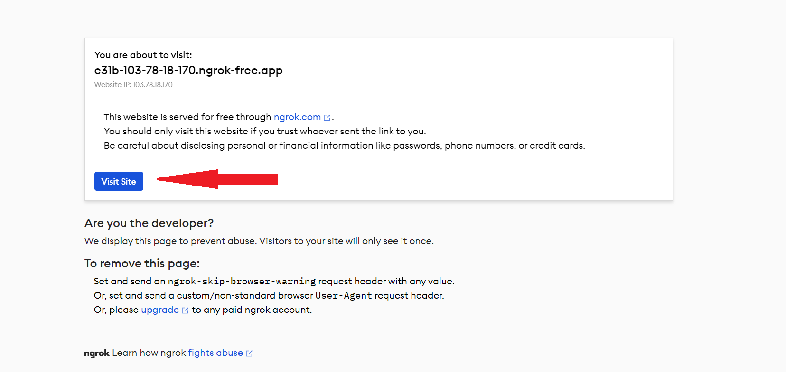
    After you click the <kbd>Visit Site</kbd> Button it will open your app, and accpet the camera permission

- For deivces outsite your network,
  - Manually type the ngrok url in your browser
  - Click on <kbd>Visit Site</kbd> Button it will open your app, and accpet the camera permission

</details>

<details id="custom-themes-setup">
<summary>Q3. How to set custom themes?</summary>

Open [`theme.css`](./theme.css) file edit the colors from there

```css
:root {
  --primary-color: darkviolet; /*Border video color*/
  --background-color: black; /*Background color (default: dark mode)*/
  --text-color: white; /*Text color*/
  --button-color: black; /*Control button color*/
  --botton-border: white; /*Control button Border*/
}
```

Restart the server to apply the changes

</details>

##### If you have any other questions or face any other issue, feel free to open a issue :)
